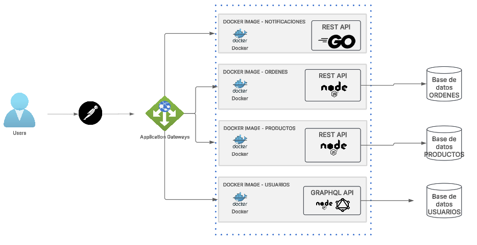

# Practica 3

Estrellita Guadalupe Armas Monroy - 201212919

● [Contratos de microservicios](https://documenter.getpostman.com/view/25929838/2sAYkBt1oL)

● Dockerfile de cada microservicio.

[Servicio de notificaciones/Dockerfile](./notification-service/Dockerfile)
[Servicio de ordenes/Dockerfile](./order-service/Dockerfile)
[Servicio de productos/Dockerfile](./product-service/Dockerfile)
[Servicio de usuarioS/Dockerfile](./user-service/Dockerfile)

● Archivo yaml (Docker compose)

[docker-compose.yml](docker-compose.yml)

● Diagrama de Arquitectura

● Diagrama ER de las bases de datos utilizadas
