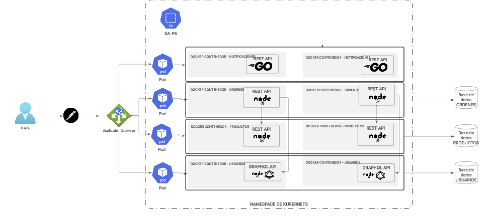

# Practica 5

Estrellita Guadalupe Armas Monroy - 201212919

### Diagrama de Arquitectura

### ¿Qué es Kubernetes?

Kubernetes es un sistema de orquestación de contenedores de código abierto que automatiza la implementación, escalado y gestión de aplicaciones en contenedores. Originalmente desarrollado por Google, Kubernetes permite a los desarrolladores y administradores de sistemas gestionar aplicaciones en contenedores de manera eficiente, proporcionando herramientas para la automatización de tareas comunes, como la implementación, el escalado y la recuperación ante fallos.

### ¿Cómo funciona un deploy en Kubernetes y cuáles son sus partes?

Un "deploy" (despliegue) en Kubernetes se refiere al proceso de implementar una aplicación en un clúster de Kubernetes. Este proceso implica varios componentes y pasos:

1. **Definición del Deployment**: Se crea un archivo de configuración (generalmente en formato YAML) que describe el estado deseado de la aplicación, incluyendo el número de réplicas, la imagen del contenedor, las variables de entorno, los volúmenes, etc.

2. **Controlador de Deployment**: Kubernetes utiliza un controlador de Deployment que se encarga de gestionar el ciclo de vida de la aplicación. Este controlador asegura que el número de réplicas de la aplicación se mantenga en el estado deseado.

3. **Pods**: Un Deployment crea y gestiona Pods, que son las unidades básicas de ejecución en Kubernetes. Un Pod puede contener uno o más contenedores que comparten el mismo almacenamiento y red.

4. **ReplicaSets**: El Deployment crea un ReplicaSet que se encarga de mantener el número deseado de Pods en ejecución. Si un Pod falla, el ReplicaSet se asegura de que se inicie un nuevo Pod para reemplazarlo.

5. **Actualizaciones y Rollbacks**: Kubernetes permite realizar actualizaciones de manera controlada y también facilita la reversión a versiones anteriores en caso de que algo salga mal.

### ¿Qué es un Deployment?

Un Deployment es un objeto de Kubernetes que proporciona una forma declarativa de gestionar la implementación de aplicaciones. Permite a los usuarios especificar el estado deseado de la aplicación (como la imagen del contenedor y el número de réplicas) y Kubernetes se encarga de crear y gestionar los Pods necesarios para alcanzar ese estado. Los Deployments también permiten realizar actualizaciones sin tiempo de inactividad y gestionar rollbacks en caso de fallos.

### ¿Qué es un Service?

Un Service en Kubernetes es un objeto que define una forma de acceder a un conjunto de Pods. Proporciona una dirección IP estable y un nombre DNS para los Pods, lo que permite que otros componentes de la aplicación se comuniquen con ellos de manera confiable, incluso si los Pods cambian o se reinician. Los Services pueden ser de diferentes tipos, como ClusterIP (acceso interno), NodePort (acceso externo a través de un puerto específico en cada nodo) o LoadBalancer (provisión de un balanceador de carga externo).

### ¿Qué es un CronJob?

Un CronJob en Kubernetes es un objeto que permite programar la ejecución de tareas periódicas en contenedores, similar a la utilidad cron en sistemas Unix. Un CronJob se define con una especificación que incluye la frecuencia de ejecución (en formato cron) y la plantilla del Pod que se debe ejecutar. Esto es útil para tareas como copias de seguridad, limpieza de datos o cualquier otra tarea que necesite ejecutarse en intervalos regulares. Kubernetes se encarga de crear y gestionar los Pods necesarios para ejecutar estas tareas según la programación definida.

## Comandos para levantar la aplicacion 

`kubectl create namespace sa-p5`
`kubectl apply -f notification-service-deployment.yaml`
`kubectl apply -f notification-service-hpa.yaml`
`kubectl apply -f notification-service-service.yaml`

