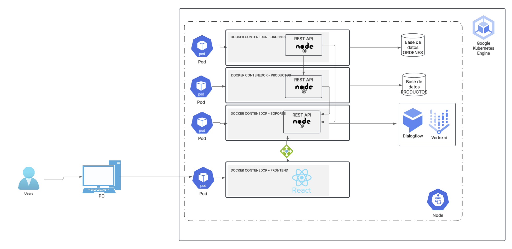

# Practica 9
Estrellita Guadalupe Armas Monroy - 201212919

# Chatbot con Node.js, React-Vite y Google Cloud AI

Este proyecto implementa un chatbot utilizando Node.js como backend, React-Vite como frontend y Google Cloud AI para la funcionalidad del chatbot.

## Características

- Interfaz de chat intuitiva
- Integración con Google Cloud AI 
- Diseño responsive

## Requisitos Previos

- Node.js (v14 o superior)
- Cuenta de Google Cloud con API key para Generative AI
- npm o yarn

## Diagrama de Arquitectura

- `/frontend`(PC): Aplicación React con Vite
- Microservicios:
    - `/ms-soporte` : microservicio encargado de la funcionalidad del chat
    - `/product-service`: microservicio encargado de la funcionalidad de los productos
    - `/order-service` : microservicio encargado de funcionalidad de ordenes
    

● [Contratos de microservicios](https://documenter.getpostman.com/view/25929838/2sAYkBt1oL)

#### Dockerfile de cada microservicio.

[Servicio de soporte/Dockerfile](./soporte-service/Dockerfile)
[Servicio de ordenes/Dockerfile](./order-service/Dockerfile)
[Servicio de productos/Dockerfile](./product-service/Dockerfile)

